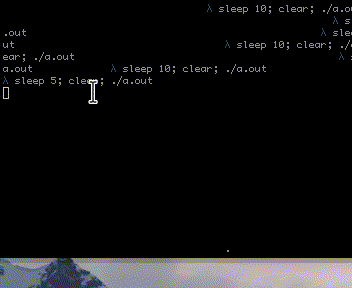

# spin

Simple UTF-8 console spinners for C.



## usage

```c
#include "spin.h"
int func() {
    spinner *s = spin_new(pat1, "Working...");
    while(working) {
        // ... do work ...
        spin_drw(s);
    }
    spin_clr(s);
    return 0;
}
```

## expanding

It's possible to add new spinner patterns, but for now, they have to be UTF8 (since there are hard coded 3 byte jumps in the code).
